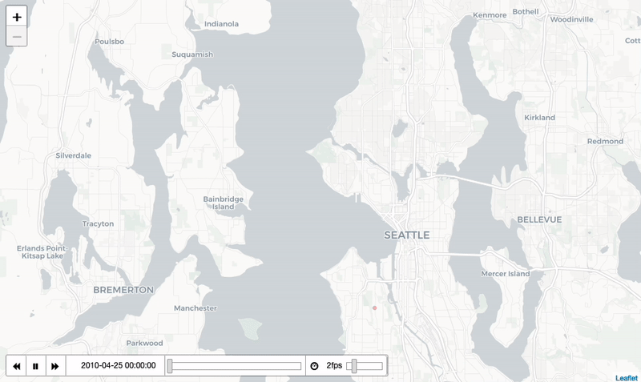
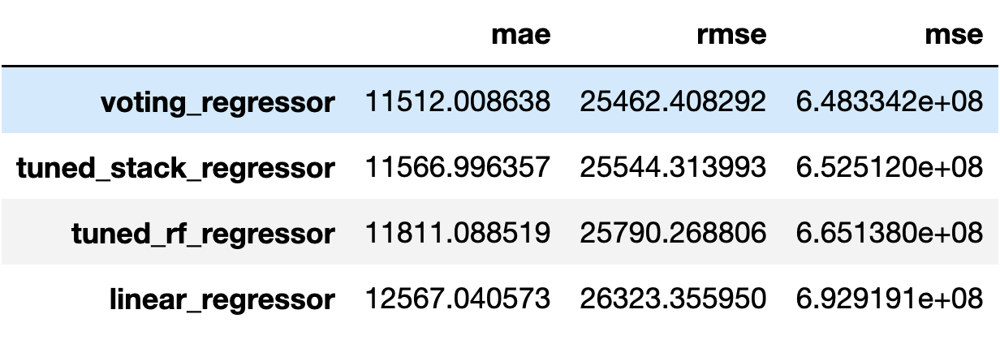

Airbnb Yearly Revenue Estimator
==============================
web app : https://airbnb-revenue.herokuapp.com

\
Airbnb listings in Seattle from 2010 to 2021

# Synopsis
Airbnb has grown exponentially since its inception in 2008 and has proved
itself to be a promising income stream for many hosts. With limited funds as
well as competition from other hosts, prospective hosts must make data-driven
decisions to maximize their listing's earning potential. In this project, we
tackle this very problem by exploring thousands of listings in Seattle as well
as attempt to create a regression model to estimate a new listing's potential
yearly revenue.

# Outcome

The most expensive Airbnb's are located downtown. The most common Airbnb
accommodates 2 and has 1 bed and bath. The median estimated yearly revenue is
$26,171

With a voting regressor consisting of stacked regressors of XGBoost, KNN, and
linear models, we were able to achieve an MAE of $11,512.01, an 8.4% increase
in performance from a multiple linear regression model. 

A model is only as good as the data it is trained on.\
Due to our limited data from Oct 2020 to July 2021, small dataset, and limited
features, our model does not perform as well as we hoped since $11k is a large
MAE compared to the median estimated yearly income. Model per performance can
definitely be improved by collecting data throughout the year and continuously
updating the model. The model's feature set is not sufficient and needs to be
supplemented with amenities and even pictures to give more information about
the quality of the listing. But as always, we risk overfitting by adding too
many features.

Project Organization
------------

    ├── LICENSE
    ├── Makefile           <- Makefile with commands like `make data` or `make train`
    ├── README.md          <- The top-level README for developers using this project.
    ├── data
    │   └── processed      <- The final, canonical data sets for modeling.
    │
    ├── docs               <- A default Sphinx project; see sphinx-doc.org for details
    │
    ├── models             <- Trained and serialized models, model predictions, or model summaries
    │
    ├── notebooks          <- Jupyter notebooks ordered by number. Contains EDA,
    │                          feature engineering, feature selection, and modeling
    │
    ├── reports            <- Generated analysis as HTML, PDF, LaTeX, etc.
    │   └── figures        <- Generated graphics and figures to be used in reporting
    │
    ├── requirements.txt   <- The requirements file for reproducing the analysis environment, e.g.
    │                         generated with `pip freeze > requirements.txt`
    │
    ├── setup.py           <- makes project pip installable (pip install -e .) so src can be imported
    ├── src                <- Source code for use in this project.
    │   ├── __init__.py    <- Makes src a Python module
    │   │
    │   ├── data           <- Scripts to download or generate data
    │   │   └── make_dataset.py
    │   │
    │   ├── features       <- Scripts to turn raw data into features for modeling
    │   │   └── build_features.py
    │   │
    │   ├── models         <- Scripts to train models and then use trained models to make
    │   │   │                 predictions
    │   │   ├── predict_model.py
    │   │   └── train_model.py
    │   │
    │   └── visualization  <- Scripts to create exploratory and results oriented visualizations
    │       └── visualize.py
    │
    └── tox.ini            <- tox file with settings for running tox; see tox.readthedocs.io

--------

<small>Project based on the <a target="_blank" href="https://drivendata.github.io/cookiecutter-data-science/">cookiecutter data science project template</a>. #cookiecutterdatascience</small>

