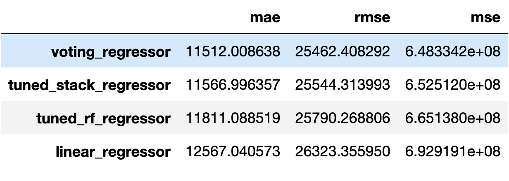

Notebooks
==============================

The purpose of these notebooks is to show the data science process that was
undergone to come up with our solution to modeling yearly revenue for Airbnb
listings. Notebooks are ordered by number, and contain results and decisions
made to move on to the next notebook.

# Summary
Through EDA, we found that there were 7166 unique listings from October 2020 to
July 2021. There were lots of missing data, but most can be filled using
intuition. The most expensive Airbnbs are located in downtown Seattle, which
also has the most Airbnbs in the city. Listings are most expensive in June on
Friday and Saturday, while they are least expensive in January on Mondays and
Tuesdays.

 

<small>Heatmap of nightly prices of Airbnb listings</small>

An Airbnb's yearly revenue is not readily available, so it was calculated by
taking all the days they were booked and adding the nightly prices for those
days together. Based on EDA, we expect Downtown listings to have higher yearly
revenues, so we created a feature that calcualated the distance from the
listing to Downtown. We also created a simplified version of `property_type`
since there were many levels that only had less than 20 observations.

There were lots of redundant features in our feature set, so we explored the
possibility of removing some. We removed `neighborhood_group_cleansed` since
location data with `latitude` and `longitude` performed a bit better. Our new
cleansed property type, `property_type_cleansed`, performed better than its
original as well as `room_type`. Sadly add `distance_dt` did not improve the
model significantly so it was not included in the final feature set.

Lastly, we did preliminary modeling to find the good models, then tuned those
models and aggregated them together in a stack ensemble and voting regressor.

# Notebook Organization

| Directory | Description |
| --- | --- |
| [EDA](0_EDA.ipynb)| A look through all the Airbnb listings from Oct 2020 to July 2021 |
| [Feature Engineering](1_feature_engineering.ipynb) | Creating yearly_revenue and other features that might be useful |
| [Feature Selection](2_feature_selection.ipynb) | Finding the best subset of features to best model yearly_revenue |
| [Modeling](3_modeling.ipynb) | Preliminary modeling as well as hyperparameter tune |
